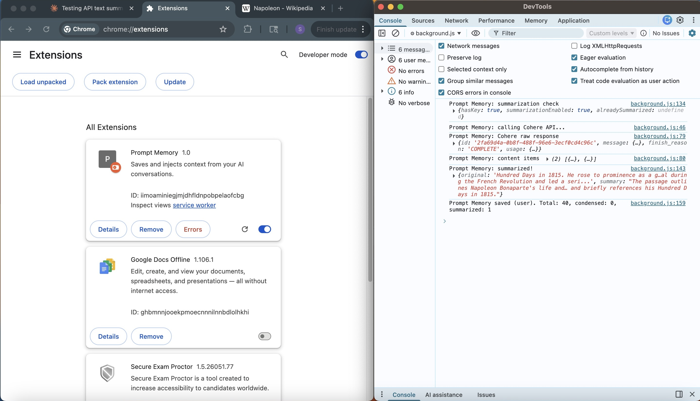

Prompt Memory:
A Chrome extension that passively captures your AI conversations and surfaces relevant saved context when you start a related conversation so you never lose the thread of a previous session.
all data stored locally in your browser, unless you CHOOSE to use an api
Built with vanilla JavaScript and Chrome's Manifest V3 extension APIs.
This project currently uses Cohere as the hardcoded LLM provider. Cohere is the recommended for simplicities sake and because they affer a free tier of usage, making it accessable to everyone. simply paste your own api key into the field  in options, and get started with the ai summarization functionality, freeing up space for the storage of more conversations. (this feature is optional, and without a key, full conversations will simply be stored in your browser, with older ones being condensed and then deleted)

What it does:
When you chat on Claude or ChatGPT, Prompt Memory saves your messages in the background. When you start a new conversation and begin typing something related, a small message appears asking if you want to inject that previous context into your current message. no copy-pasting, no digging through old tabs.
The picture below showcases the succesfull condensing of a question about napolean.

Features:
Passive capture: saves your prompts automatically as you chat, no manual action needed.
Keyword matching: compares what you're currently typing against saved entries using token overlap scoring.
AI summarization: condenses saved AI responses via your chosen api before storing them, keeping context short and useful.
Non-intrusive UI: a minimal toast notification that auto-dismisses after 8 seconds if ignored.
One-click injection: apends saved context directly into the active input field.
Persistent storage: saved entries survive browser restarts via chrome.storage.local.
Scoped to AI sites: only activates on claude.ai and chatgpt.com, not every site you visit.

Tech stack:
Chrome Extension Manifest V3
Vanilla JavaScript
Css
Html
